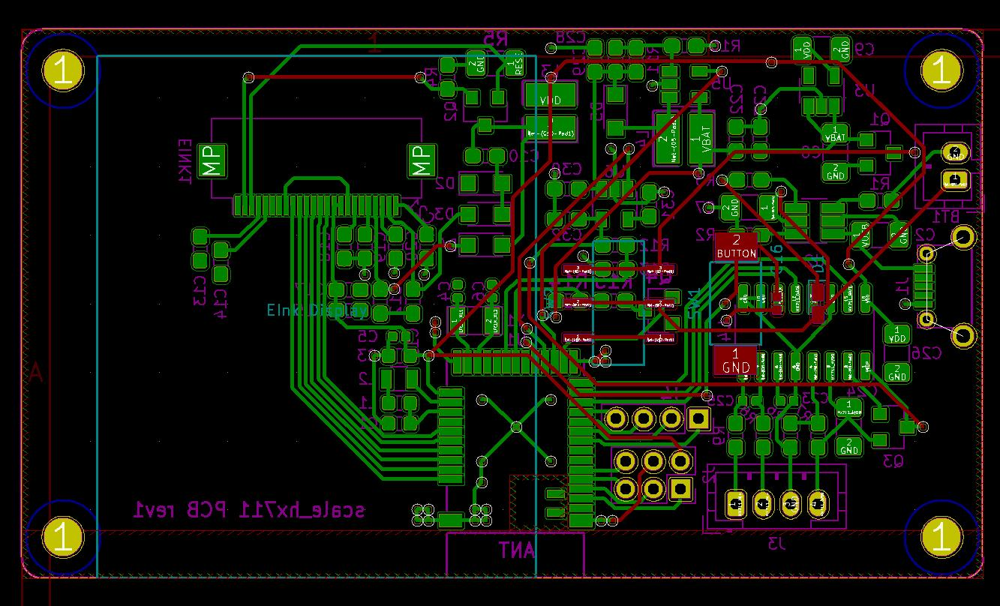

# Smart Weighing Scale  

This project describes a Smart Weighing Scale with low current consumption, and hence a long battery backup.

One of the biggest problems with the use of weighing scales in flexible retail or industrial applications is the need to provide a source of power to a scale. This causes problems such as safety hazards with a corded scale, inflexibility of placement since the location of power sources limits where the scale can be placed, and finally the inability to function when there is a power interruption. This design eliminates these disadvanteges.

## Firmware
After cloning or downloading this repo find the firmware documentation here "weighing_scale_nrf/firmware/bootloader/documentation/index.html".

## Circuit

### Power Supply
The nrf Based Weighing Scale operates on 3.3V, and is powered by a 3.7V Li-ion battery.
We use a p-MOSFET(IRLML6401) for reverse polarity protection, and a LDO(Low Drop Out) Regulator(TPS7A0233PDBV) to get a stable 3.3V output supply.


### Battery Charging
We use a Li-ion/Li-polymer linear battery charger IC(BQ21040) for charging the battery via a micro-USB outlet. The led indicator stops glowing when the battery is fully charged.

### nRF Module


We are using the MDBT42Q nRF52840 based module as our main MCU and BLE module. It is a very low current consuming and high performance module.
It needs a 3.3V power supply, and we are using its internal DC/DC regulator which is set by connecting a 10uH and 18nH inductor at DCC and DEC4 pins as shown here. We also use an external 32.768 kHz external crystal. For programming this module we need a Segger JLink Debugger, which is available as a separate device or one could use an on-board debugger from any of the Nordic Dev-boards like PCA400, etc...
We kept a few GPIOs out for future use or if need to integrate anything else with the weighing scale.


To measure the battery level we use this voltage divider circuit and measure it use the on board ADC pins.


Tare Button is a push button for using the tare functionality. It basically resets the displayed weight on scale back to zero. The Tare button can also be used to measure multiple items in the same container. Simply add you first item, note the weight, press Tare and you are ready to weigh your next item.

### ADC Circuit: HX711

For measuring the weighing scale we use a Load Cell which gives an anlog output, as the weight changes. For high accuracy we use HX711 24-bit ADC chip, which is designed specifically for industrial weighing scales and other industrial control applications.


To power the HX711 we need a 5V supply, so we use a Boost regulator(LM2703) to step-up the 3.7V from the battery supply and use an LDO(LP2985-5.0) to get a stable noise free 5V supply for HX711.

The data from the Load Cell is received via four pins HX711_IN+, HX711_IN-, HX711_AVDD and GND. This data is processed by the ADC chip and an output is send via serial interface to the nRF module. We can control the output data rate as either 10Hz or 80Hz by controlling the HX711_RATE pin state.
There is no programming needed for the internal registers. All controls to the HX711 are through the pins.

### E-Ink Display


We decided to go with an E-Ink display as it is very low power consuming, reflection resistant, and was useful for the application we were targeting.
This is a 1.54" 200x200 pixel [E-Ink display](https://www.e-paper-display.com/products_detail/productId=513.html) from Good Display.


## PCB
This is what the final PCB design looks like:




## Hardware Builds

Hardware design files are available in the "design" sub-folder

We tried 3 different designs for the weighing scale project and settled with the "HX711" based design as our final.

So you will find the final design explained on the main page.

The other two designs of "LPV821" and "LTC6915" based weighing scales are also fully functional, one may have to play around with the adc functions in the firmware though.

## Software Builds

One can find the main application with all library files(for e-ink display, and weighing scale) in the "Application" folder.

To setup the Nordic SDK and bootloader files follow the links in "Bootloader" folder. Also, the "documentation" folder has some good technical data.

To make changes in the firmware go to "weighing_scale_nrf/firmware/application/w_scale_all/" and make necessary changes.

To build the output files, go to the same location and use this command to generate final output files(.hex):
```
make release
```

Then use the following to flash and debug the firmware:
```
make upload
```

This is a custom makefile, so make sure all Debugger setings are proper. Like, make sure the Debugge name and Serial Number are correct.

These can be set in this [makefile](https://github.com/IoTReady/weighing_scale_nrf/blob/master/firmware/application/w_scale_all/Makefile).
